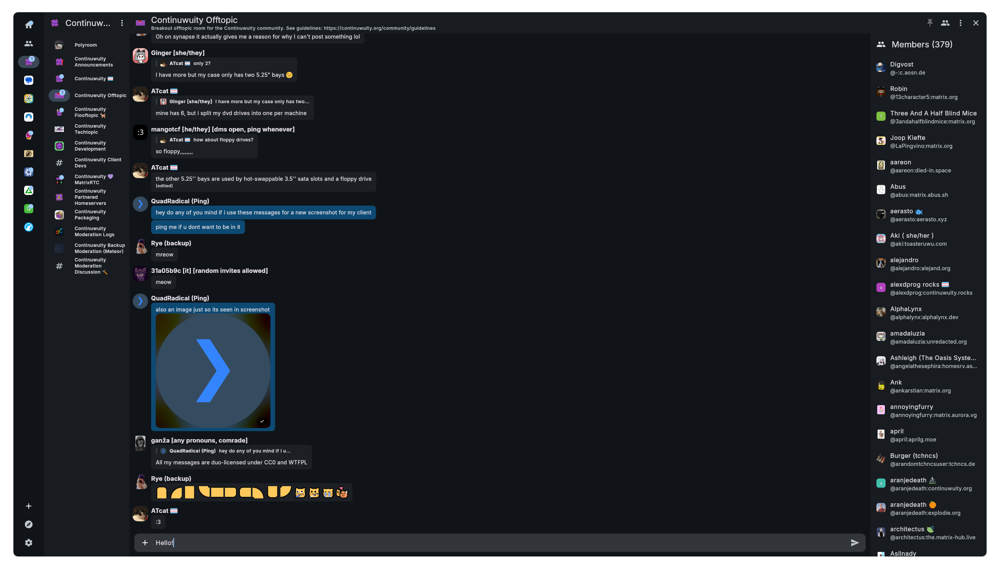
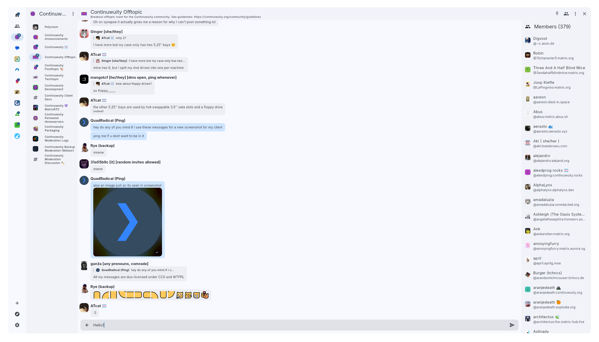

# Nexus Client

> [!WARNING]
> Nexus Client is still heavily in development, and is not ready for use!

## Description

A simple and user-friendly Matrix client made with Flutter and the Matrix Dart SDK.

## Screenshots

|                                                                                  Dark Mode                                                                                   |                                    Light Mode                                    |
| :--------------------------------------------------------------------------------------------------------------------------------------------------------------------------: | :------------------------------------------------------------------------------: |
|  |  |

## Progress

-   [x] Move from the Dart SDK to the Gomuks SDK with Dart bindings: https://git.federated.nexus/Henry-Hiles/nexus/pulls/2
-   [ ] Platform Support
    -   [x] Linux
    -   [x] Windows
    -   [ ] MacOS
    -   [ ] Android
    -   [ ] iOS
    -   [ ] Web (may not be possible)
-   [x] Login
    -   [x] Username / password auth
    -   [ ] OAuth / OIDC
-   [x] Rooms / Spaces
    -   [x] Displaying and choosing
    -   [x] Reading, showing unread
        -   [x] Mark as read button on rooms and spaces
    -   [ ] Searching
    -   [ ] Creating (Rooms, Spaces, and DMs)
    -   [x] Joining
        -   [x] Using a text/uri/link
            -   [x] Plain text
            -   [x] `matrix:` Uri
            -   [ ] Matrix.to link: I just need to fix my regex, I should do this soon.
        -   [ ] From space
        -   [ ] Exploring
    -   [x] Leaving
    -   [x] Subspaces
-   [x] Messages
    -   [x] Encryption
        -   [x] Restoring crypto identity from a recovery passphrase/key
    -   [x] Sending
        -   [x] Plain text
        -   [x] HTML/Markdown
        -   [x] Replies
        -   [ ] Attachments
        -   [x] Mentions
            -   [x] Users
            -   [x] Rooms
        -   [ ] Custom emojis/stickers
        -   [ ] GIFs using Giphy
    -   [x] Recieving
        -   [x] Plain text
        -   [x] HTML
        -   [x] Replies
            -   [x] Viewing
            -   [ ] Jump to original message
        -   [x] Edits
        -   [x] Attachments
            -   [x] Unencrypted
            -   [ ] Encrypted
            -   [x] Blurhashing
            -   [ ] Downloading attachments
            -   [x] Opening attachments in their own view
        -   [ ] Polls: Waiting on https://github.com/SwanFlutter/dynamic_polls/issues/1
        -   [x] Mentions
            -   [x] Users
            -   [x] Rooms
                -   [ ] Plain text (not sure if I want to add this or not, I probably won't unless there's interest)
                -   [x] Matrix URIs
                -   [x] Matrix.to links
        -   [x] Custom emojis/stickers
        -   [x] History loading
            -   [x] Backwards
            -   [ ] Forwards
    -   [x] Editing
    -   [x] Deleting
-   [ ] Reactions: Waiting on https://github.com/flyerhq/flutter_chat_ui/pull/838 or me doing a custom impl
-   [ ] Pins
    -   [ ] Displaying
    -   [ ] Creating
-   [ ] Threads
-   [ ] Profile popouts
-   [ ] Copy link to [room, space]
-   [ ] Reporting
    -   [x] Events
    -   [ ] Rooms
-   [ ] Notifications using UnifiedPush
-   [ ] Group calls using [MSC4195](https://github.com/matrix-org/matrix-spec-proposals/pull/4195)
-   [ ] Invites
    -   [ ] Viewing / accepting
    -   [ ] Spam filtering
-   [ ] Settings
    -   [ ] Light/Dark mode
    -   [ ] Show media by default
    -   [ ] Dynamic Theming
    -   [ ] Devices
        -   [ ] Viewing devices
        -   [ ] Verifying devices
    -   [ ] URL preview: Server / Client / None
    -   [ ] Account changes
        -   [ ] Display name
        -   [ ] Profile picture
        -   [ ] Timezone
        -   [ ] Pronouns
        -   [ ] Password
    -   [ ] About
    -   [x] Log Out

## Build Instructions

First, clone and open the repo:

```sh
git clone https://git.federated.nexus/Henry-Hiles/nexus
cd nexus
```

### Prerequisites

#### Linux

-   With Nix: Either use direnv, or `nix flake develop`
-   Without Nix: Install Flutter, Go, Olm, Git, Clang, and GLibc.

#### Windows / MacOS

I don't really know. You will need Flutter, Git, Olm, Go, and Visual Studio tools, and otherwise I guess just keep installing stuff until there aren't any errors. I will look into this sometimeTM.

### Set up Flutter

Get dependencies:

```sh
flutter pub get
```

Get dependencies:

```sh
flutter pub get
```

Clone Gomuks and generate bindings:

```sh
scripts/generate.sh
```

Build generated files, and watch for new changes:

```sh
flutter pub run build_runner watch --delete-conflicting-outputs
```

Run the app:

```sh
flutter run
```

## Community

Join the [Nexus Client Matrix Room](https://matrix.to/#/#nexus:federated.nexus) for questions or help with developing or using Nexus Client.
