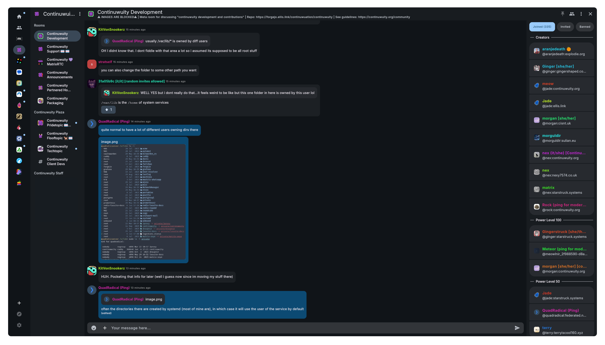
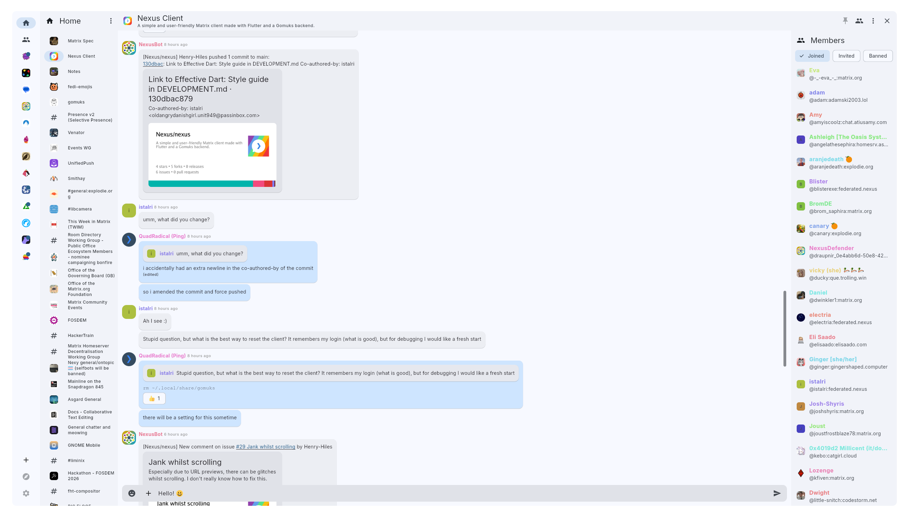

# Nexus Client

> [!WARNING]
> Nexus Client is still heavily in development, and is not ready for use!

## Description

A simple and user-friendly Matrix client made with Flutter and a Gomuks backend.

## Screenshots

|                                                                                  Dark Mode                                                                                   |                                    Light Mode                                    |
| :--------------------------------------------------------------------------------------------------------------------------------------------------------------------------: | :------------------------------------------------------------------------------: |
|  |  |

## Progress

- [ ] New logo
- [ ] Make context menus appear as bottom sheets on mobile
- [x] Move from the Dart SDK to the Gomuks Backend with Dart bindings: https://git.federated.nexus/Henry-Hiles/nexus/pulls/2
    - [ ] Allow using remote Gomuks over websocket
- [ ] Platform Support
    - [x] Linux
    - [ ] Windows (WIP)
    - [ ] MacOS
    - [x] Android
    - [ ] iOS
    - [ ] Web (may not be possible)
- [x] Login
    - [x] Username / password auth
    - [ ] OAuth / OIDC
    - [x] Improve initial sync experience
- [x] Rooms / Spaces
    - [x] Displaying and choosing
    - [x] Reading, showing unread
        - [x] Mark as read button on rooms and spaces
    - [ ] Searching
    - [ ] Creating (Rooms, Spaces, and DMs)
    - [x] Joining
        - [ ] Parse vias
        - [x] Using a text/uri/link
            - [x] Plain text
            - [x] `matrix:` Uri
            - [x] Matrix.to link
        - [ ] From space
        - [ ] Exploring
    - [x] Leaving
    - [x] Subspaces
- [x] Messages
    - [x] Encryption
        - [x] Restoring crypto identity from a recovery passphrase/key
    - [x] Sending
        - [x] Plain text
        - [x] HTML/Markdown
        - [x] Replies
            - [x] Choose ping on/off
        - [ ] Per message profiles
        - [ ] Attachments
        - [ ] Commands with [MSC4391](https://github.com/matrix-org/matrix-spec-proposals/pull/4391)
        - [x] Mentions
            - [x] Users
            - [x] Rooms
            - [ ] Inline emoji picker (Putting this here since it'll be implemented the same way as mentions)
        - [ ] Custom emojis/stickers
        - [ ] GIFs using Gomuks' GIF proxies
    - [x] Recieving
        - [x] Plain text
        - [x] Per message profiles
        - [x] HTML
        - [x] Replies
            - [x] Viewing
            - [ ] Jump to original message
                - [x] In loaded timeline
                - [ ] Out of loaded timeline
        - [x] Edits
        - [x] Attachments
            - [x] Unencrypted
            - [ ] Encrypted
            - [x] Blurhashing
            - [ ] Downloading attachments
            - [x] Opening attachments in their own view
        - [ ] Polls: Waiting on https://github.com/SwanFlutter/dynamic_polls/issues/1
        - [x] Mentions
            - [x] Users
            - [x] Rooms
                - [ ] Plain text (not sure if I want to add this or not, I probably won't unless there's interest)
                - [x] Matrix URIs
                - [x] Matrix.to links
            - [ ] Do some fancy fetching to get nice names
            - [ ] Make clickable
        - [x] Custom emojis/stickers
        - [x] History loading
            - [x] Backwards
            - [ ] Forwards
    - [x] Editing
    - [x] Deleting
- [ ] Reactions: Waiting on https://github.com/flyerhq/flutter_chat_ui/pull/838 or me doing a custom impl
- [ ] Pins
    - [ ] Displaying
    - [ ] Creating
- [ ] Threads
- [ ] Profile popouts
- [ ] Copy link to [room, space]
- [ ] Reporting
    - [x] Events
    - [ ] Rooms
- [ ] Notifications using UnifiedPush
- [ ] Group calls using [MSC4195](https://github.com/matrix-org/matrix-spec-proposals/pull/4195)
- [ ] Invites
- [ ] Settings
    - [ ] Light/Dark mode
    - [ ] SSD or CSD
    - [ ] Show media by default
    - [ ] Dynamic Theming
    - [ ] Devices
        - [ ] Viewing devices
        - [ ] Verifying devices
    - [ ] URL preview: Server / Client / None
    - [ ] Account changes
        - [ ] Display name
        - [ ] Profile picture
        - [ ] Timezone
        - [ ] Pronouns
        - [ ] Password
    - [ ] About
    - [x] Log Out

## Build Instructions

### Prerequisites

#### Linux

- With Nix: Either use direnv and `direnv allow`, or `nix flake develop`
- Without Nix: Install Flutter, Go, Git, Libclang, and Glibc. Do not use any Snap packages, they cause various compilation issues.

#### Windows / MacOS

I don't really know. You will need Flutter, Git, Go, and Visual Studio tools, and otherwise I guess just keep installing stuff until there aren't any errors. I will look into this sometimeTM.

### Clone repo

First, clone and open the repo:

```sh
git clone --recurse-submodules https://git.federated.nexus/Henry-Hiles/nexus
cd nexus
```

### Set up Flutter

Get dependencies:

```sh
flutter pub get
```

Generate Gomuks bindings:

```sh
dart scripts/generate.dart
```

Build generated files, and watch for new changes:

```sh
flutter pub run build_runner watch --delete-conflicting-outputs
```

Run the app:

```sh
flutter run
```

## Community

Join the [Nexus Client Matrix Room](https://matrix.to/#/#nexus:federated.nexus) for questions or help with developing or using Nexus Client.
